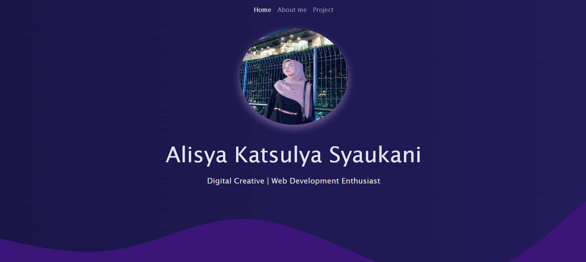
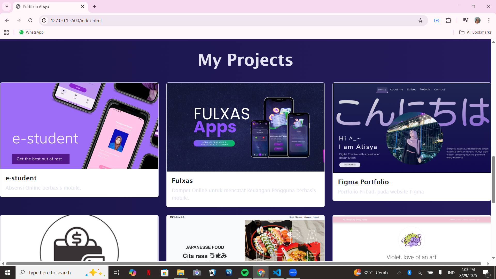

# 🎨 Portfolio Website

Portfolio sederhana menggunakan **HTML, CSS, dan Bootstrap**, dengan sentuhan custom design untuk tampilan lebih elegan dan modern.

---

## 🚀 Fitur
- Tampilan responsive menggunakan **Bootstrap**  
- Desain background gradient yang clean dan modern  
- Efek teks gradien di bagian heading  
- Section **About** untuk profil singkat  
- Foto profil berbentuk **rounded** dan card-style  
- Footer dengan informasi kontak  

---

## 📂 Struktur Project
📁 belajar-bootstrap

 ┣ 📄 index.html
 
 ┣ 📄 style.css
 
 ┣ 🖼️ 1.png
 
 ┣ 🖼️ 2.png
 
 ┣ 🖼️ 3.png
 
 ┣ 🖼️ 4.png
 
 ┣ 🖼️ 5.png
 
 ┣ 🖼️ 6.png
 
 ┣ 🖼️ pp.jpg

---

## 🛠️ Teknologi yang Digunakan
- [HTML5](https://developer.mozilla.org/en-US/docs/Web/HTML)
- [CSS3](https://developer.mozilla.org/en-US/docs/Web/CSS)
- [Bootstrap 5](https://getbootstrap.com/)

---

## 📸 Preview

